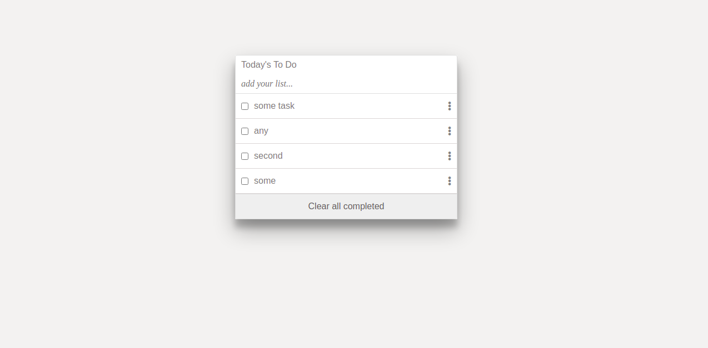

# To Do List
In this project, I build a simple HTML list of To Do tasks. This simple web page is built using webpack and served by a webpack dev server.

## Built With

- JavaScript
- Webpack

 ## Live Demo

[Visit the Live Demo](https://mhdez221993.github.io/to_do_list/)
## Getting Started

To get a local copy up and running follow these simple example steps.

Go to `https://github.com/Mhdez221993/to_do_list`

1. Click on the code and copy the HTML code.
2. Use terminal to clone this repository on your local machine.
3. Run <code>git checkout -b your-branch-name</code>. Make your contributions.
4. Push your branch up to your forked repository.
5. `npm install`.
5. `npm run build`.
5. `npm run start`.

## Authors

👤 **Moises Hernandez Coronado**

- GitHub: [@Mhdez221993](https://github.com/Mhdez221993)
- Twitter: [@MoisesH42060050](https://twitter.com/MoisesH42060050)
- LinkedIn: [Moises Hernandez Coronado](https://www.linkedin.com/in/moises-hernandez-9bbb17145/)

## Contributing

Contributions, issues, and feature requests are welcome!

Feel free to check the [issues page](https://github.com/Mhdez221993/to_do_list/issues).

## Show your support

Give a ⭐️ if you like this project!

## Acknowledgments

- To my Stand Up Team and coding partners who kept my morale up!
